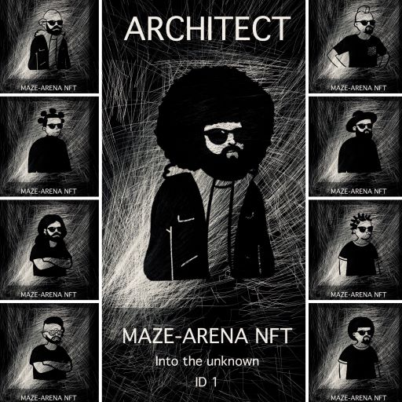

## MAZE-ARENA NFT - Into the unknown

MAZE-ARENA NFT is an experimental multi-token contract (non-fungible and fungible tokens - ERC1155).

MAZE-ARENA NFT is (the first ?) collection of ERC1155 NFTs on Bitcoin Cash SmartBCH.

Contract address: 0x7c0C2f18aeF4B0cC84D9E397aE47867aC04AEA19

[Source code](contracts/MazeArena.sol)



```
Token id	Level		Character	Initial supply	Total supply		

1	 	Legendary	Architect	20		500
2 		Mystic		Wizard		40		500
3 		Mystic		Visionary	60		500
4 		Epic		Gearhead	80		500
5 		Epic		Cyborg		100		500
6		Epic		Hero		120		500
7 		Solo		Spy		140		500
8 		Solo		Warrior		160		500
9 		Solo		Brawler		180		500
10 		Solo		Savage		200		500
```

_MetaMask does not fully support ERC155 yet. You may see "Unable to load Balance". You may not be able to send ERC115 NFTs with MetaMask. You need to interact with a contract through anoter app e.g. [ARENA NFT Checker](https://mazetoken.github.io/arena/checker).

You can also use [MAZE-ARENA](https://oneclickdapp.com/koala-yes) - OneClickDapp - to interact with the contract, for example:

- to send one of MAZE-ARENA tokens open this oneclickdapp link above and connect your wallet (MetaMask). Next tap on Write tab, tap on safeTransferFrom and paste your address in the FROM filed, paste address you want to send token to in TO field, paste token id in the ID field, paste amount (eg. 1) and paste 0x0000000000000000000000000000000000000000000000000000000000000000 in the DATA field. Tap submit and approve transaction


### MetaMask settings:

_import token_

Token Address: 0x7c0C2f18aeF4B0cC84D9E397aE47867aC04AEA19

Token Symbol: MAZE-ARENA

Token of Precision: 0

_go to NFT tab - Import NFTs_

Address: 0x7c0C2f18aeF4B0cC84D9E397aE47867aC04AEA19

ID: ... - paste Token id

_You may need to tap "import" twice"_

Read about [ERC1155](https://eips.ethereum.org/EIPS/eip-1155)

------------------------------------------------------------------------------------
MAZE Tokens Underworld 2020-2022

[Telegram](https://t.me/mazetokens)

