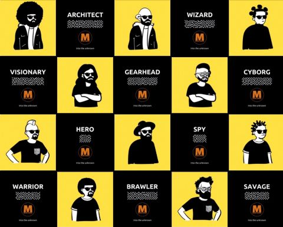

## MAZE-ARENA NFT - Into the unknown - [MAZE Token](https://mazetoken.github.io) Collectibles.

Contract address: 0x7c0C2f18aeF4B0cC84D9E397aE47867aC04AEA19

MAZE-ARENA is (the first ?) collection of ERC1155 NFTs (semi-fungible tokens) on Bitcoin Cash SmartBCH network.

Read about [ERC1155](https://eips.ethereum.org/EIPS/eip-1155)



```
Token id	Level		Character	Token supply		

1	 	Legendary	Architect	20
2 		Mystic		Wizard		40
3 		Mystic		Visionary	60
4 		Epic		Gearhead	80
5 		Epic		Cyborg		100
6		Epic		Hero		120
7 		Solo		Spy		140
8 		Solo		Warrior		160
9 		Solo		Brawler		180
10 		Solo		Savage		200
```

### MetaMask settings. MetaMask does not fully support ERC155 yet. You may see "Unable to load Balance". It is because "balanceOfBatch" is not implemented, I guess. You may not be able to send ERC115 NFTs with MetaMask.

_import token_

Token Address: 0x7c0C2f18aeF4B0cC84D9E397aE47867aC04AEA19

Token Symbol: MAZE-ARENA

Token of Precision: 0

_go to NFT tab - Import NFTs_

Address: 0x7c0C2f18aeF4B0cC84D9E397aE47867aC04AEA19

ID: ... (Token id)

